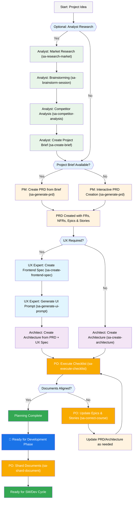
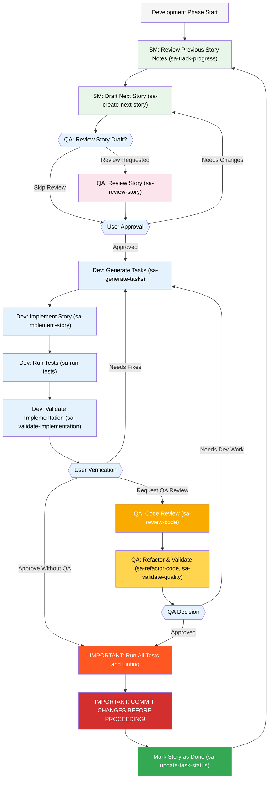

# Super Agents Framework User Guide

This guide will help you understand and effectively use the Super Agents Framework for AI-powered development assistance.

## The Super Agents Plan and Execute Workflow

The Super Agents Framework provides a structured approach to AI-powered development, combining the proven methodologies of BMAD with the powerful MCP tool integration. It scales from individual developers to large teams while maintaining both strategic depth and tactical efficiency.

If you do not see the diagrams that follow rendering, you can install Markdown All in One along with the Markdown Preview Mermaid Support plugins to VSCode (or one of the forked clones). With these plugins, if you right click on the tab when open, there should be an Open Preview option, or check the IDE documentation.

### The Planning Workflow (Web UI or Powerful IDE Agents)

Before development begins, Super Agents follows a structured planning workflow that's ideally done in powerful IDEs with Claude Code or similar:



### The Core Development Cycle (IDE)

Once planning is complete and documents are sharded, Super Agents follows a structured development workflow:



## Installation

### Quick Installation

```bash
# Install globally via npm
npm install -g super-agents-framework

# Or use the CLI installer
npx super-agents-framework install
```

### Interactive Setup

```bash
# Run the setup wizard
sa setup

# This will guide you through:
# - IDE selection (Claude Code, Cursor, VS Code, etc.)
# - API key configuration (Anthropic, OpenAI)
# - Agent selection and preferences
# - Project initialization options
```

### Project Setup

```bash
# Initialize a new project with Super Agents
sa init my-project --template=fullstack --agents=all

# Navigate to your project
cd my-project

# Install dependencies
npm install

# Start the MCP server
npm run sa:start
```

## Agent System

Super Agents provides 10 specialized agents, each with their own MCP tools and capabilities:

### Core Agents

#### Analyst (Mary)
**Role**: Strategic analysis, market research, and requirements gathering
**Key Tools**:
- `sa-research-market` - Comprehensive market research and trend analysis
- `sa-brainstorm-session` - Structured brainstorming for ideation
- `sa-competitor-analysis` - Competitive analysis and positioning
- `sa-create-brief` - Project brief and requirement summaries

**Usage Example**:
```bash
# In Claude Code or compatible IDE
sa-research-market topic="AI development tools market trends"
sa-brainstorm-session focus="innovative features for productivity tools"
```

#### Product Manager (John)
**Role**: Product strategy, PRD creation, and feature prioritization
**Key Tools**:
- `sa-generate-prd` - Product Requirements Document creation
- `sa-create-epic` - Epic creation with detailed specifications
- `sa-prioritize-features` - Feature prioritization and roadmapping
- `sa-stakeholder-analysis` - Stakeholder needs and requirements analysis

**Usage Example**:
```bash
sa-generate-prd requirements="user authentication system with social login"
sa-create-epic prd="docs/prd.md" epic="user management"
```

#### Architect (Winston)
**Role**: System design, architecture, and technology recommendations
**Key Tools**:
- `sa-create-architecture` - Comprehensive system architecture design
- `sa-analyze-brownfield` - Existing system analysis and recommendations
- `sa-design-system` - Component and design system architecture
- `sa-tech-recommendations` - Technology stack recommendations

**Usage Example**:
```bash
sa-create-architecture prd="docs/prd.md" requirements="microservices, high availability"
sa-tech-recommendations requirements="React frontend, Node.js backend, database selection"
```

#### Developer (James)
**Role**: Implementation, coding, debugging, and testing
**Key Tools**:
- `sa-implement-story` - User story implementation with code generation
- `sa-debug-issue` - Debug analysis and troubleshooting
- `sa-run-tests` - Test execution and validation
- `sa-validate-implementation` - Code validation against requirements

**Usage Example**:
```bash
sa-implement-story story="user registration with email verification"
sa-debug-issue component="authentication" error="JWT token validation failing"
```

#### QA (Quinn)
**Role**: Quality assurance, code review, and refactoring
**Key Tools**:
- `sa-review-code` - Comprehensive code review and quality assessment
- `sa-refactor-code` - Code refactoring for improved quality
- `sa-validate-quality` - Quality standards validation
- `sa-review-story` - Story completeness and quality review

**Usage Example**:
```bash
sa-review-code files="src/auth/" focus="security,performance"
sa-refactor-code target="reduce complexity in user service"
```

### Specialized Agents

#### UX Expert (Sally)
**Role**: UI/UX design, wireframes, and frontend specifications
**Key Tools**:
- `sa-create-frontend-spec` - Detailed frontend specifications
- `sa-design-wireframes` - UI wireframes and mockups
- `sa-generate-ui-prompt` - AI UI generation prompts
- `sa-accessibility-audit` - Accessibility compliance checks

#### Product Owner (Sarah)
**Role**: Backlog management, story validation, and course correction
**Key Tools**:
- `sa-validate-story-draft` - Story validation and completeness
- `sa-execute-checklist` - Checklist execution and validation
- `sa-correct-course` - Project course correction and guidance
- `sa-shard-document` - Document breakdown and management

#### Scrum Master (Bob)
**Role**: Workflow orchestration, story creation, and progress tracking
**Key Tools**:
- `sa-create-story` - Detailed user story creation
- `sa-create-next-story` - Next story in development sequence
- `sa-track-progress` - Project progress and velocity tracking
- `sa-update-workflow` - Workflow state management

#### Task Master
**Role**: Task analysis, complexity estimation, and planning
**Key Tools**:
- `sa-generate-tasks` - Task breakdown from requirements
- `sa-analyze-complexity` - Task complexity and effort estimation
- `sa-expand-task` - Detailed task expansion and subtasks
- `sa-parse-prd` - PRD parsing into actionable tasks

#### Workflow Manager
**Role**: Process management, workflow validation, and orchestration
**Key Tools**:
- `sa-start-workflow` - Workflow initialization and setup
- `sa-workflow-status` - Workflow status and phase tracking
- `sa-workflow-validation` - Workflow state validation
- `sa-track-progress` - Cross-workflow progress monitoring

## How Agents Work

### MCP Integration

Super Agents uses the Model Context Protocol (MCP) for seamless IDE integration:

```json
{
  "mcpServers": {
    "super-agents": {
      "command": "node",
      "args": ["sa-engine/mcp-server/index.js"],
      "env": {
        "SA_PROJECT_ROOT": ".",
        "ANTHROPIC_API_KEY": "${ANTHROPIC_API_KEY}",
        "OPENAI_API_KEY": "${OPENAI_API_KEY}"
      }
    }
  }
}
```

### Agent Interaction

**In Claude Code:**
```bash
# Direct MCP tool usage
sa-research-market topic="project requirements"
sa-create-architecture requirements="scalable web application"
sa-implement-story story="user authentication"
```

**In Cursor/VS Code:**
```bash
# Through agent personas
@analyst research market trends for our product idea
@architect design a scalable microservices architecture
@developer implement the user login functionality
```

### Tool Dependencies and Templates

Each agent has access to:
- **Specialized Tools**: 40+ MCP tools organized by expertise
- **Templates**: 15+ templates for code, documents, and architectures
- **Workflows**: Predefined development workflows
- **Context**: Shared knowledge base and preferences

## IDE Integration

### Supported IDEs

- **Claude Code** (Recommended) - Full MCP integration
- **Cursor** - Agent personas and tool integration
- **VS Code** - Through extensions and MCP
- **Windsurf** - Agent-based interaction
- **Generic AI Tools** - Manual setup available

### Best Practices

- **Context Management**: Keep relevant files only in context
- **Agent Selection**: Use appropriate agent for each task
- **Iterative Development**: Work in small, focused tasks
- **File Organization**: Maintain clean project structure
- **Commit Regularly**: Save your work frequently

## Configuration System

### Environment Variables

```bash
# Core configuration
export SA_LOG_LEVEL=info
export SA_MAX_RETRIES=3
export SA_TIMEOUT=30000

# API keys
export ANTHROPIC_API_KEY=your_anthropic_key
export OPENAI_API_KEY=your_openai_key

# Optional providers
export GOOGLE_API_KEY=your_google_key
```

### Configuration File

Create `sa-config.json` in your project root:

```json
{
  "logLevel": "info",
  "agents": {
    "enabledAgents": ["analyst", "pm", "architect", "developer", "qa"],
    "defaultAgent": "developer"
  },
  "apis": {
    "anthropic": {
      "model": "claude-3-sonnet-20240229",
      "maxTokens": 4000,
      "temperature": 0.7
    },
    "openai": {
      "model": "gpt-4",
      "maxTokens": 4000,
      "temperature": 0.7
    }
  },
  "workflows": {
    "defaultWorkflow": "greenfield-fullstack",
    "enableValidation": true
  }
}
```

### Technical Preferences

Super Agents includes a personalization system through technical preferences:

```yaml
# sa-engine/data/technical-preferences.md
preferred_languages:
  - TypeScript
  - Python
  - Go

preferred_frameworks:
  frontend:
    - React
    - Next.js
  backend:
    - Express.js
    - FastAPI

coding_standards:
  - ESLint with Airbnb config
  - Prettier for formatting
  - Jest for testing

architecture_patterns:
  - Microservices
  - Clean Architecture
  - Repository Pattern
```

## Health Monitoring and Diagnostics

### Health Check

```bash
# Comprehensive system health check
sa doctor

# Detailed diagnostics with verbose output
sa doctor --verbose

# Check specific components
sa doctor --component=mcp-server
sa doctor --component=agents
sa doctor --component=configuration
```

### Repair Tools

```bash
# Automatic issue detection and repair
sa repair

# Repair specific issues
sa repair --issue=configuration
sa repair --issue=api-connectivity
sa repair --issue=mcp-server
```

### Monitoring

```bash
# View system status and metrics
sa status

# View detailed metrics
sa status --metrics

# Monitor tool performance
sa status --performance
```

## Advanced Features

### Custom Workflows

Define project-specific workflows in YAML:

```yaml
# workflows/custom-feature-dev.yaml
name: "Custom Feature Development"
description: "Specialized workflow for feature development"
phases:
  - name: "Research & Analysis"
    agents: ["analyst"]
    tools: ["sa-research-market", "sa-brainstorm-session"]
    validation: "research_complete"
    
  - name: "Planning & Design"
    agents: ["pm", "architect", "ux-expert"]
    tools: ["sa-generate-prd", "sa-create-architecture", "sa-create-frontend-spec"]
    validation: "design_approved"
    
  - name: "Implementation"
    agents: ["developer", "qa"]
    tools: ["sa-implement-story", "sa-run-tests", "sa-review-code"]
    validation: "tests_passing"
```

### Template System

Create reusable templates for common patterns:

```yaml
# templates/custom-component.yaml
name: "Custom React Component"
type: "code"
variables:
  - name: "componentName"
    type: "string"
    required: true
  - name: "props"
    type: "array"
    required: false
template: |
  import React from 'react';
  import { {{componentName}}Props } from './types';
  
  export const {{componentName}}: React.FC<{{componentName}}Props> = ({
    {{#each props}}
    {{name}},
    {{/each}}
  }) => {
    return (
      <div className="{{kebabCase componentName}}">
        {/* TODO: Implement {{componentName}} */}
      </div>
    );
  };
```

### Integration Examples

#### Greenfield Project Setup

```bash
# 1. Initialize new project
sa init ecommerce-platform --template=fullstack

# 2. Research and planning
sa-research-market topic="e-commerce platform features"
sa-generate-prd requirements="online store with inventory management"

# 3. Architecture design
sa-create-architecture prd="docs/prd.md" type="microservices"

# 4. Begin development
sa-create-story epic="user-authentication" priority="high"
sa-implement-story story="user-registration-email-verification"
```

#### Brownfield Integration

```bash
# 1. Analyze existing codebase
sa-analyze-brownfield path="./existing-project" focus="architecture,patterns"

# 2. Create improvement plan
sa-correct-course analysis="brownfield-analysis.md" focus="modernization"

# 3. Incremental improvements
sa-refactor-code target="legacy authentication system"
sa-validate-quality component="user management" standards="modern practices"
```

## Troubleshooting

### Common Issues

1. **MCP Server Not Starting**
   ```bash
   # Check configuration
   sa doctor --component=mcp-server
   
   # Verify API keys
   sa doctor --component=configuration
   
   # Restart server
   npm run sa:start
   ```

2. **Tools Not Available in IDE**
   ```bash
   # Verify MCP integration
   sa doctor --component=ide-integration
   
   # Re-run setup
   sa integrate --ide=claude-code --reconfigure
   ```

3. **Agent Not Responding**
   ```bash
   # Check agent configuration
   sa status --agents
   
   # Test specific agent
   sa-list-tasks agent="developer"
   ```

### Debug Mode

Enable detailed logging for troubleshooting:

```bash
# Set debug log level
export SA_LOG_LEVEL=debug

# Run with verbose output
sa doctor --verbose

# Check logs
tail -f sa-engine/logs/super-agents-$(date +%Y-%m-%d).log
```

## Performance Optimization

### Tool Performance

- Tools execute in < 5 seconds average
- Automatic retry with exponential backoff
- Graceful degradation for service outages
- Performance monitoring and alerting

### Memory Management

- Efficient context management
- Automatic cleanup of temporary files
- Memory usage monitoring
- Garbage collection optimization

### Concurrent Operations

```bash
# Run multiple tools in parallel
sa-research-market topic="market analysis" &
sa-generate-prd requirements="product specs" &
sa-create-architecture design="system overview" &
wait
```

## Getting Help

### Resources

- **Documentation**: [Super Agents Docs](docs/)
- **GitHub Issues**: [Report bugs](https://github.com/super-agents/framework/issues)
- **Implementation Summary**: [Production Readiness](IMPLEMENTATION_SUMMARY.md)
- **API Reference**: Complete MCP tool documentation in CLAUDE.md

### Support Channels

- **GitHub Discussions**: Community support and questions
- **Email Support**: support@super-agents.dev
- **Status Updates**: Check system status and announcements

### Community

- **Contributing**: See [Contributing Guide](CONTRIBUTING.md)
- **Examples**: Browse example projects and workflows
- **Templates**: Share and discover community templates

## Conclusion

Super Agents Framework is designed to enhance your development process through intelligent agent orchestration and powerful MCP integration. It scales from individual projects to enterprise teams while maintaining both strategic depth and tactical efficiency.

The framework provides:
- **40+ specialized MCP tools** across 10 agent types
- **Production-ready infrastructure** with comprehensive error handling
- **Flexible workflows** that adapt to your development process
- **Easy integration** with modern AI-powered IDEs

Remember: Super Agents is designed to augment your expertise, not replace it. Use it as a powerful tool to accelerate your projects while maintaining control over design decisions and implementation details.

**Next Steps:**
1. Complete the [Quick Installation](#quick-installation)
2. Run through the [Interactive Setup](#interactive-setup)
3. Try the [Project Setup](#project-setup) with a simple project
4. Explore [Agent Interaction Examples](#agent-interaction) in your IDE
5. Configure [Advanced Features](#advanced-features) as needed

---

*Built with ❤️ by the Super Agents team - Empowering developers with AI-powered assistance.*